```mermaid
%%{init: {'themeVariables': { 'fontFamily': 'Arial'}}}%%
graph TD
    classDef process fill:#e1f5fe,stroke:#0288d1,stroke-width:1px,color:#000000;
    classDef decision fill:#fff9c4,stroke:#fbc02d,stroke-width:1px,color:#000000;
    classDef data fill:#e8f5e9,stroke:#388e3c,stroke-width:1px,color:#000000;
    classDef terminal fill:#37474f,stroke:#37474f,color:#ffffff,stroke-width:2px;
    classDef highlight fill:#fce4ec,stroke:#c2185b,stroke-width:2px,color:#000000;

    Start([Start Generation]):::terminal --> Ph1

    %% ================= Phase 1 =================
    subgraph Ph1 [Phase 1: Geometry & Kinematics]
        direction TB
        G1[Shape Selection]:::process --> G2["vMF / Pseudo-Watson<br/>Orientation Control"]:::process
        G2 --> G3["Geometry / Skeleton Generation<br/>(Includes Math Booleans)"]:::process
        G3 --> G4["Crop & CM Standardization<br/>(Local Kinematics Definition)"]:::process
        G4 --> Cache[(Geometry Cache<br/>& Dual-Shell Offsets)]:::data
    end

    %% ================= Phase 2 =================
    subgraph Ph2 [Phase 2: RSA Core Placement]
        direction TB
        R1[Sample Valid Matrix Coordinate]:::process
        Cache -.-> R1
        R1 --> R2{Numba JIT Fast Check<br/>Overlap & Protrusion}:::decision
        R2 -- "Fails > 500" --> R2a[Switch to Soft-Core<br/>Overlap Allowed]:::highlight
        R2a --> R1
        R2 -- Success --> R3[Bitwise Write to Grid]:::process
        R3 --> R4["Bit 128: Overlap Flag<br/>Bits 4-6: Thin Counter<br/>Bits 0-3: Thick Counter"]:::highlight
        R4 --> Registry[(Placement Registry<br/>Kinematics & Coords)]:::data
    end

    Ph1 --> R1
    R4 -- Target VF Reached --> D1

    %% ================= Phase 3 =================
    subgraph Ph3 [Phase 3: Affine Deformation & Rendering]
        direction TB
        D1{Mechanical Stretch<br/>Requested? λ ≠ 1.0}:::decision
        Registry -.-> D1
        
        D1 -- Yes --> D1a{Deformation Mode}:::decision
        
        D1a -- Coarse --> DC["Paste Raw Offsets<br/>(Fast Translation)"]:::process
        
        D1a -- Fine --> D2[CM Affine Translation]:::process
        D2 --> D3["Rigid-Body Rotation<br/>(Polar Decomposition)"]:::process
        D3 --> D_Tilt["2-Axis Tilt Compensation<br/>(Volume Ledger Neutralization)"]:::highlight
        D_Tilt --> D4["Dynamic Bounding Box Redraw<br/>(Re-calculate Dual Shells)"]:::process
    end

    %% ================= Phase 4 =================
    subgraph Ph4 [Phase 4: Dual-Radii Interface Generation]
        direction TB
        I1{Physics Mode?}:::decision
        
        I1 -- Thermal --> I2["Extract overlap Bit 128"]:::process
        I2 --> I3["PBC-Aware EDT<br/>(Primary: d <= 1.5)"]:::process
        I3 --> I3a["Secondary:<br/>n_thin >= 1 & n_thick >= 2"]:::highlight
        
        I1 -- Electrical / Mechanics --> I5["Decode Bitwise Counters"]:::process
        I5 --> I6["Primary: n_thin >= 2<br/>or Dilated Bit 128"]:::highlight
        I6 --> I7["Secondary:<br/>n_thin == 1 & n_thick >= 2"]:::highlight
        
        I3a --> I_Clean["Anchored Cleanup<br/>(Bridges protected by Fillers)"]:::highlight
        I7 --> I_Clean
        I_Clean --> I_Heal["Majority Filler Vote<br/>(Thermal Path Healing)"]:::process
    end

    D4 --> I1
    DC --> I1
    D1 -- No --> I1
    I_Heal --> Ph5

    %% ================= Phase 5 =================
    subgraph Ph5 [Phase 5: Structure Analysis]
        direction TB
        A1[PBC-Aware Union-Find]:::process --> A2[Compute Structure Metrics<br/>connectivity, contact, tunneling]:::process
    end

    A2 --> End([Output Final Voxel Grid & CSV]):::terminal
```

# RSA Filler Placement Algorithm Architecture

This document outlines the design and implementation of the Hybrid Random Sequential Adsorption (RSA) algorithm used in `microsimflow`.

To achieve high-density packing, physical accuracy, and seamless integration with downstream mechanical deformations, this algorithm abandons the traditional "paint-and-forget" voxel approach. Instead, it relies on a strict separation of **Kinematics (skeleton and rotation)** and **Voxel Rendering (rasterization)**, coupled with bitwise memory management.

-----

## 1. Filler Geometry & Kinematic Standardization

Instead of drawing fillers directly into the massive global grid, the algorithm first generates a "stamp" in a localized bounding box. During this phase, the exact Center of Mass (CM) is mathematically standardized. *(Note: Topology-adaptive fibers bypass this module as they grow directly in the global grid).*

| **Shape** | **Step 1: Skeleton / Orientation** | **Step 2: Voxel Rendering** | **Step 3: Kinematics Definition** | **Step 4: CM Standardization** |
| :--- | :--- | :--- | :--- | :--- |
| **Sphere** | Isotropic geometry; no orientation calculation needed. | Fill voxels satisfying `x^2 + y^2 + z^2 <= r^2` in the local grid. | No rotation or deformation. Local coordinates are fixed at `[0,0,0]`. | The geometric center aligns perfectly with the true Center of Mass (CM). |
| **Flake** | Generate a rotation matrix `R_orig` using a **von Mises-Fisher (vMF) distribution** for targeted orientation control (`mean_dir`, `kappa`), replacing isotropic random Euler angles. | Apply inverse rotation to the coordinate grid and evaluate the disk equation. | Store `R_orig` to preserve rotational state. Local coordinate is `[0,0,0]`. | Geometric center is the CM. During affine stretch, polar decomposition extracts the pure rigid-body rotation to track orientation. |
| **Irregular Fiber** | Use vMF-based `R_orig`. Generate 2D mathematical masks (ellipse, bean, or c-shape) extended along the local Z-axis. | Apply the specific mathematical mask to the inverse-rotated local coordinate grid. | Store `R_orig` to preserve the precise fiber axis orientation. Local coordinate is `[0,0,0]`. | The geometric center aligns with the CM. Polar decomposition guarantees the cross-section shape does not distort during affine stretching. |
| **Staggered** (Layered Flakes) | Use vMF-based `R_orig` as the base. Determine local centers by shifting along the Z-axis (layer thickness) and applying random XY offsets. | On the inverse-rotated grid, draw multiple disks based on the distance from each layer's local center. | Store the list of local center coordinates for all layers. | Calculate the true CM from the multi-layer distribution and strictly correct the center offset. |
| **Rigid Fiber** | Generate a directional vector based on vMF distribution. Create a straight backbone coordinate list by stepping forward until length *L* is reached. | Apply a fast "spherical brush" to each point on the backbone (bypassing slow dilation operations). | Store the straight backbone coordinate list. | Calculate the average of all backbone points to find the true CM and apply offset correction. |
| **Flexible Fiber** | Based on straight steps, but injects random noise (bend angles) at certain probabilities to deflect the direction vector. | Apply the fast spherical brush to the bent backbone. | Store the bent backbone coordinate list (used later to enforce inextensibility during affine stretch). | Calculate the true CM of the bent shape, then crop empty margins of the voxel mask to standardize the bounding box. |
| **Agglomerate** | Call the `Flexible Fiber` skeleton generator multiple times, shifting each by a random offset from a central point. | Generate masks for all individual fibers and overlay them in a single local grid. | Store a combined list of all fiber backbones. | Calculate the CM from all coordinates of all fibers in the bundle and correct the massive mask's offset. |

**Advanced Kinematics & Generation Features:**
* **Unified Orientation Control:** All anisotropic fillers utilize a unified distribution model. Setting `kappa > 0` generates von Mises-Fisher (vMF) polar alignment, while `kappa < 0` produces Pseudo-Watson equatorial/girdle alignment.
* **Multi-point Kinematics Tracking:** Complex structures like `agglomerate` and `staggered` maintain arrays of local coordinates (`local_kinematics`), allowing individual constituents to be tracked and accurately repositioned during downstream affine deformation.
* **Math-only Booleans for Irregular Shapes:** Irregular cross-sections (`bean`, `c-shape`) bypass expensive morphological dilations by directly evaluating pure mathematical boolean masks on the local coordinate grid.

-----

## 2. High-Performance Placement Logic (The RSA Core)

To prevent combinatorial explosion and computational bottlenecks during high-volume fraction packing, the placement loop utilizes advanced memory and caching optimizations.

| Step | Process | Implementation & Optimization Strategy |
| --- | --- | --- |
| **1** | **Pre-extract Dual Shells** | Both **Thick** ($R_{thick}$) and **Thin** ($R_{thin}$) shells are pre-calculated for the local stamp. $R_{thin}$ is automatically defined as $\lceil tunnel\_radius / 2 \rceil$ to ensure mid-gap connectivity. |
| **2** | **Geometry Caching** | Stamps and dual-shell offsets are cached and reused for up to 50 attempts to reduce CPU overhead. |
| **3** | **Smart Sampling** | Starting points are strictly sampled from valid Polymer A coordinates. |
| **4** | **Protrusion & Overlap Check** |  **Numba JIT** collision engine (`_check_and_place_fast`) evaluates boundaries and overlaps using C-level array indexing. |
| **5** | **Voxel Writing & Flagging** | Writes IDs and updates bitwise counters in the global `comp_grid` and `shell_count_grid`. |
| **6** | **Placement Registry** | Logs kinematics and coordinates for downstream affine deformation (mechanical stretching). |

#### Soft-Core Fallback (Hybrid Placement)

To achieve ultra-high volume fractions (VF) beyond the theoretical jamming limit of standard RSA, the algorithm employs a dynamic fallback mechanism:

* **Hard-Core Mode (Default):** Fillers are placed with strict non-overlapping rules using the ultra-fast Numba JIT engine.
* **Soft-Core Transition:** If the algorithm fails to find a valid placement after 500 consecutive attempts (`consecutive_fails > 500`), it automatically transitions to Soft-Core mode (`overlap_mode = True`).
* **Best-of-N Overlap Minimization:** In Soft-Core mode, the algorithm samples multiple candidate locations (Best-of-N) and selects the one that causes the *least* amount of physical overlap. The overlapping voxels are rigorously tracked using **Bit 7 (Value 128)** in the `shell_count_grid` for downstream interface healing.

-----

## 3. Unified Placement & Physics-Aware Interface Generation

To maintain strict physical integrity across solvers, voxels are mapped to specific structural IDs:
* **`0`**: Polymer A (Matrix)
* **`1`**: Polymer B (e.g., TPMS Interface)
* **`2`**: **Secondary Interface** (Tunneling Gap / Kapitza Bridge)
* **`3`**: **Primary Interface** (Direct Contact Overlap)
* **`4+`**: Fillers

**The placement phase (Phase 1) is completely agnostic to the physics mode.** The algorithm guarantees that newly placed fillers *never* overwrite existing fillers, thereby protecting the target Volume Fraction (VF).

Instead of overwriting, the algorithm utilizes bitwise operations on an unsigned 8-bit integer array (`shell_count_grid`) to invisibly track overlaps and shell proximity. The physical meaning of these bits is interpreted later during the interface generation phase.

### Phase 1: Bitwise Placement Tracking (All Modes)

Instead of a simple counter, `shell_count_grid` (uint8) uses bit-partitioning to track proximity and physical overlaps simultaneously without extra memory: 

* **Bit 7 (Value 128):** **Physical Overlap Flag**. Set when fillers intersect in Soft-Core mode. 
* **Bits 4-6:** **Thin Shell Counter** ($n_{thin}$). Tracks proximity to filler surfaces within $R_{thin}$. 
* **Bits 0-3:** **Thick Shell Counter** ($n_{thick}$). Tracks proximity within $R_{thick}$ (user-defined `tunnel_radius`). 

### Phase 2: Physics-Specific Resolution

Once placement is complete, the bitwise data is decoded to construct physical interfaces: 

| **Process** | **Thermal Mode** (Heat Conduction) | **Electrical / Mechanics Mode** (Conductivity / Stiffness) |
| --- | --- | --- |
| **Primary Interface (ID: 3)**  *(Direct Contact)* | Extracts **Bit 7**. Applies a Distance Transform (threshold $\le 1.5$) to isolate thin contact resistance zones.  | Defined by **$n_{thin} \ge 2$** (1-voxel gap) OR an **expanded physical overlap** (Bit 7 dilated by `contact_radius`).  |
| **Secondary Interface (ID: 2)**  *(Tunneling Bridge)* | Defined by **$n_{thin} \ge 1$ AND $n_{thick} \ge 2$**. This ensures bridges are slim and anchored to filler centers.  | Defined by **$n_{thin} = 1$ AND $n_{thick} \ge 2$**. Captures proximity bridges while excluding those already assigned as Primary.  |

### Robust Anchored Cleanup

To stabilize solvers, a 3-stage anchored cleanup is applied. Unlike standard morphological filters, this logic treats **Fillers as anchors** to prevent the erosion of valid 1-voxel bridges: 

1. **Sliver Fill:** 1-voxel polymer gaps trapped between filler and interface are converted to interface. 
2. **Anchored Spike Removal:** Removes burrs with $< 2$ neighbors, where neighbors include both interface and filler voxels. 
3. **Anchored Island Cleanup:** Eliminates floating interface voxels not connected to any network. 

**Self-Healing Interfaces (Thermal Mode):** 
If the cleanup pipeline deletes a primary interface voxel, it creates a void in the conduction path. To prevent this, the Thermal mode utilizes a `Majority Filler Vote` (`np.argmax` over 6-neighbors) to intelligently reassign the deleted interface voxel to the most dominant adjacent filler ID.

**PBC-Aware Distance Transform:**
To measure the direct contact thickness in Thermal mode accurately, the algorithm temporarily pads the global grid using `mode='wrap'` before executing the Distance Transform, ensuring flawless interface calculations across Periodic Boundary Conditions (PBC).

-----

## 4. Percolation and Structure Analysis

To evaluate the percolation threshold and conductivity networks of the generated microstructure, a high-performance graph analysis algorithm is implemented.

* **PBC-Aware Union-Find:** A Numba JIT-compiled algorithm (`label_pbc_6n_fast`) identifies connected conductive clusters using a 6-neighborhood structure. It strictly enforces Periodic Boundary Conditions (PBC), seamlessly wrapping connections across the grid boundaries.
* **Metrics Extracted:**
  * `connectivity_ratio`: The volume of the largest conductive cluster divided by the total volume of all conductive candidates (fillers + interfaces).
  * `contact_ratio`: The ratio of the Primary Interface (ID: 3) voxels to the total filler voxels.
  * `tunneling_ratio`: The ratio of the Secondary Interface (ID: 2) voxels to the total filler voxels.

-----

## 5. Affine Deformation & Rendering Module

To support downstream mechanical experiments, the placement registry dynamically redraws geometries into an affine-deformed grid. This module supports two distinct rendering modes:

**A. Coarse Mode (High Performance):**
Maps the original, unstretched voxel offsets (`raw_offsets`) directly to the newly translated physical Center of Mass (CM). It bypasses rotation calculations, offering extreme speed for rapid macroscopic network evaluations.

**B. Fine Mode (Strict Rigid-Body Kinematics):**
1. **CM Translation & Polar Decomposition:** The physical CM is shifted using the deformation gradient tensor (`F_mat`). `scipy.linalg.polar` extracts the pure rigid-body rotation to ensure fillers rotate without distortion.
2. **Dynamic Bounding Box Rendering:** The local kinematics are transformed and redrawn strictly within a tightly cropped bounding box to prevent memory explosion.
3. **Volume Ledger & Tilt Compensation:** Due to pixelation artifacts during rotation, voxel counts may fluctuate. The algorithm tracks this deviation globally via a `volume_error_ledger`. If a placement deviates beyond a tolerance (`fine_volume_tol`), the algorithm evaluates small 2-axis tilt compensations to select the mask that best neutralizes the cumulative volume error, rigorously protecting the target VF.

-----

